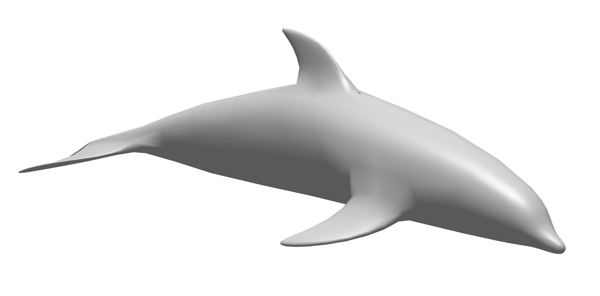

# ds-loader

The ds-loader is a NiiVue plugin that converts [3DS](https://www.spacesimulator.net/tutorials/3ds_loader_tutorial.html) files into mz3 meshes. While 3DS format is simple and historically popular, it has [inherent shortcomings](https://en.wikipedia.org/wiki/.3ds#Shortcomings) The rationale for this plugin is to provide a minimal loader to illustrate NiiVue mesh plugin loader design.



## Local Development

To illustrate this library, `ds2mz3` is a node.js converter that can be run from the command line:

```
git clone git@github.com:rordenlab/ds-loader.git
cd ds-loader
npm install
node ./src/ds2mz3.js ./tests/testData/monu1.vox
```

## Local Browser Development

You can also embed this loader into a hot-reloadable NiiVue web page to evaluate integration:

```
git clone git@github.com:rordenlab/ds-loader.git
cd vox-loader
npm install
npm run dev
```

## Sample datasets

- [John Burkardt sample 3DS meshes](https://people.math.sc.edu/Burkardt/data/3ds/3ds.html). Note the sample meshes included in this repository are from here.